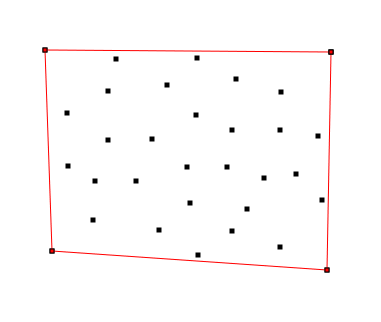

# ConvexHull for 2D Points
> An implementation of the Gift-Wrapping algorithm for finding convex hull of points in a 2D plane.

 This is an implementation of the Gift-Wrapping algorithm to find the convex hull of a given set of points in a 2D plane. The algorithm runs in `O(nh)`, where `n` is the number of points in the set, and `h` is the number of points in the convex hull.

 Visualization is generated with GTK and Cairo.

<br>

## Images




<br>

## Dependencies
* [GTK 3.0](https://www.cairographics.org/examples/)
* [Cairo](https://www.cairographics.org/)


<br>

## Compiling and Running
```
make clean && make all
./hull.out
```

Input and output paths are set inside the program.