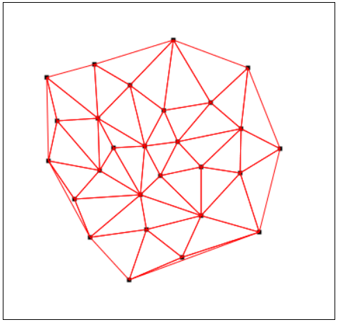
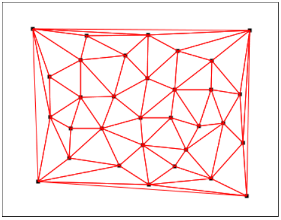
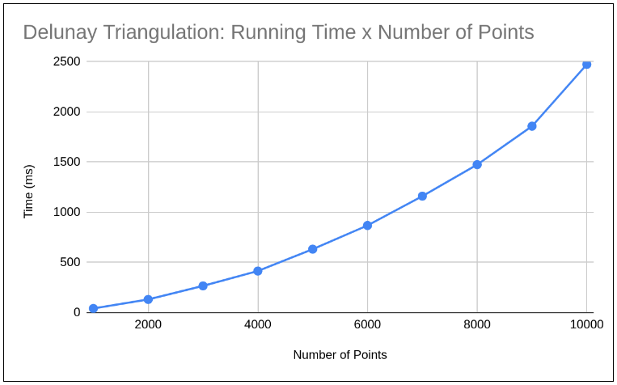

# Delunay Triangulation
> An implementation of Divide-and-Conquer algorithm for finding a Delunay Triangulation of a set of points in a 2D plane.

 This is an implementation of the SuperTriangle Divide-and-Conquer algorithm to find the Delunay Triangulation of a given set of points in a 2D plane. The algorithm runs in `O(n²)`, where `n` is the number of points in the set.

 Visualization is generated with GTK and Cairo.

<br>

## Images





<br>

## Runtime
As expected, the runtime is `O(n²)`.


<br>

## Dependencies
* [GTK 3.0](https://www.cairographics.org/examples/)
* [Cairo](https://www.cairographics.org/)


<br>

## Compiling and Running
```
make clean && make all
./delunay.out
```

Input and output paths are set inside the program.