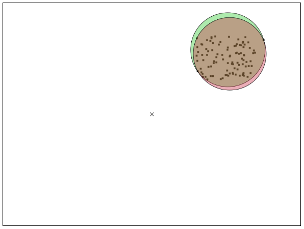
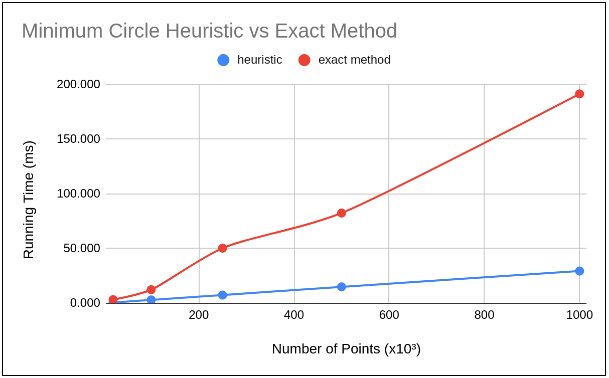

# ConvexHull for 2D Points
> Implementation of two algorithms to find the minimum covering circle of a set of points.

 This is an implementation of two algorithms that try to solve the [minimum covering circle problem](https://en.wikipedia.org/wiki/Smallest-circle_problem): An exact algorithm and a heuristic algorithm.

**The exact algorithm** yields the correct solution, and has expected complexity of `O(n)`, where `n` is the number of points.

**The heuristic algorithm** yields an approximation of the correct solution, and has expected complexity of `O(n)`, but differs from the exact algorithm by a costant factor. `n` stands for the number of points.


 Visualization is generated with GTK and Cairo.

<br>

## Images

Here, the red circle is the exact solution and the green circle is the heuristic solution. We can see that they are actually quite close.



<br>

## Run Time

As expected, runtime of both algorithms are linear, but differ by a constant factor.




<br>

## Dependencies
* [GTK 3.0](https://www.cairographics.org/examples/)
* [Cairo](https://www.cairographics.org/)


<br>

## Compiling and Running
```
make clean && make all
./minCircle.out
```

Input and output paths are set inside the program.