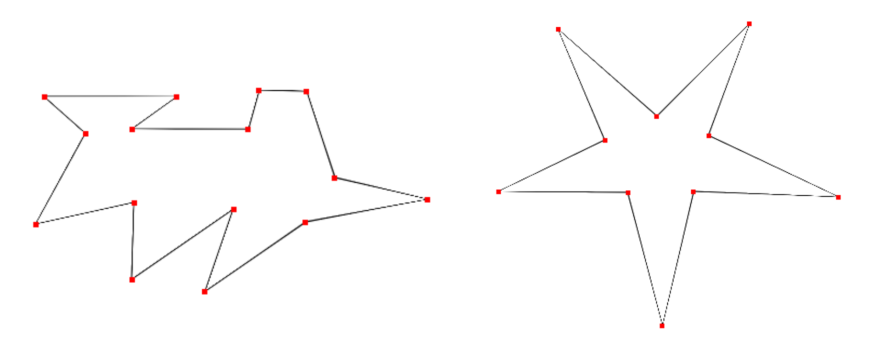
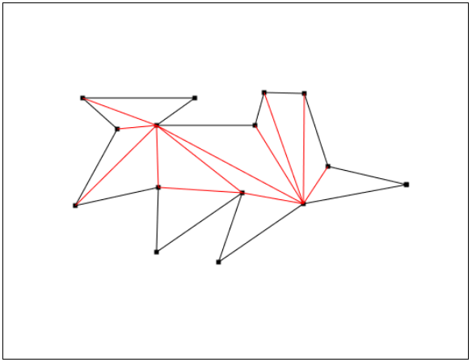
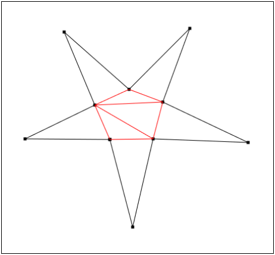

# Polygon Triangulation
> An implementation of the ear-clipping algorithm for triangulating a polygon.

 This is an implementation of the Ear-Clipping algorithm to find a trinagulation of a polygon. The algorithm runs in `O(n²)`, where `n` is the number of points that define the polygon. The underlying structure used to facilitate the algorithm is a circular doubly linked list, that is used to represent the polygon's border.

 Visualization is generated with GTK and Cairo.

<br>

## Images

### Original Input



### Results




<br>

## Dependencies
* [GTK 3.0](https://www.cairographics.org/examples/)
* [Cairo](https://www.cairographics.org/)


<br>

## Compiling and Running
```
make clean && make all
./triangulation.out
```

Input and output paths are set inside the program.